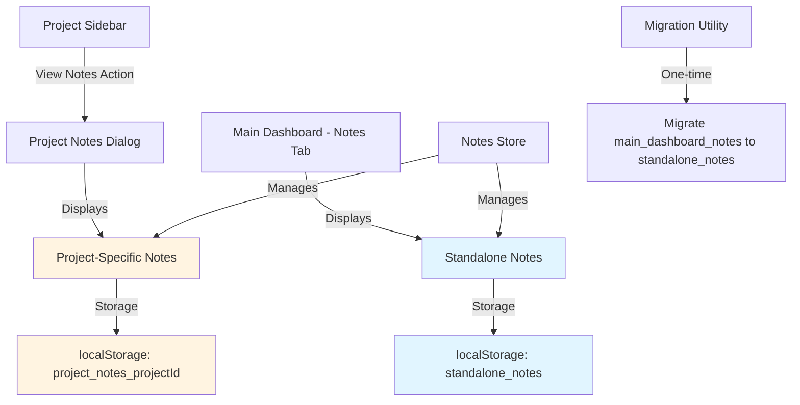
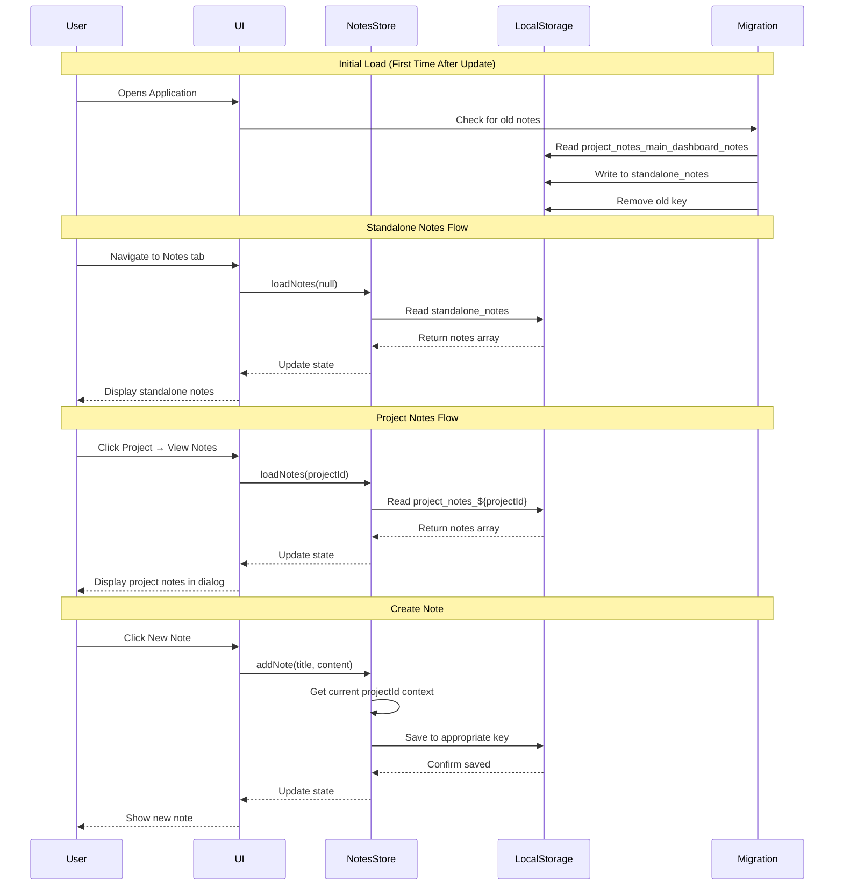
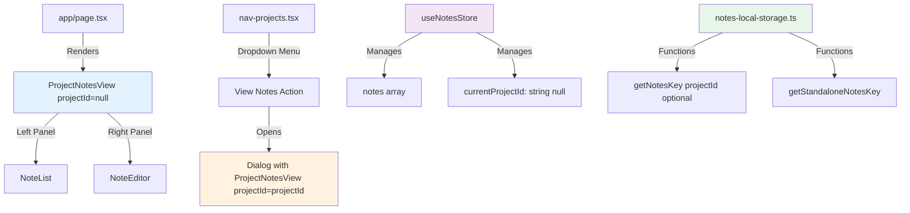

# Implementation Plan: Optional Project Association for Notes

**Session**: session | **Date**: 2025-11-05 | **Complexity**: Medium

## Executive Summary

- **Goal**: Enable notes to exist independently (standalone) or be associated with specific projects, with clear UI separation between the two types
- **Approach**: Make `projectId` optional in Note interface, create separate storage for standalone notes, update state management to handle both contexts, and add UI navigation to access project-specific notes
- **Effort**: 4-6 hours (spread across 5 phases)
- **Risk**: Medium - involves data migration and state management changes, but well-isolated with clear rollback paths

## Architecture

### System Overview



### Data Flow



### Component Structure



### Key Design Decisions

1. **Optional ProjectId Pattern**: Follow the existing Task model where `projectId?: string` allows null/undefined for standalone items
   - **Rationale**: Consistency with existing codebase patterns, TypeScript-friendly, clear semantic meaning

2. **Separate Storage Keys**: Use `standalone_notes` for null projectId and `project_notes_${projectId}` for projects
   - **Rationale**: Maintains existing storage pattern, avoids conflicts, enables independent data management

3. **Single Store with Context**: Keep one `useNotesStore` with `currentProjectId` that can be null
   - **Rationale**: Consistent with task store pattern, reduces code duplication, simpler state management

4. **Dialog for Project Notes**: Show project notes in a dialog/drawer rather than navigating away
   - **Rationale**: Maintains context, consistent with app's single-page design, better mobile experience

5. **Automatic Migration**: Run one-time migration on first load after update
   - **Rationale**: Seamless upgrade experience, preserves user data, non-destructive (keeps backup)

6. **Context-Aware UI**: Show clear visual indicators (headers, badges) for note type
   - **Rationale**: User clarity, prevents confusion, aligns with UX best practices

## Implementation Phases

### Prerequisites
- [x] Research completed and findings documented
- [ ] Backup recommendation communicated to team
- [ ] Review plan with stakeholders
- [ ] Set up test scenarios for migration

### Phase 1: Data Model & Storage Layer
**Goal**: Update type definitions and storage functions to support optional projectId

**Steps**:

1. **Update Note interface**
   - Action: Make `projectId` optional in Note type
   - Files: `/Users/usuario1/Documents/me/ai/aitas/types/note.ts`
   - Changes:
     ```typescript
     export interface Note {
         id: string;
         projectId?: string; // Changed from required to optional
         title: string;
         content: string; // Markdown format
         createdAt: string; // ISO string
         updatedAt: string; // ISO string
     }
     ```
   - Verify: Run `npm run build` - should compile without errors

2. **Add standalone notes storage key helper**
   - Action: Add constant and helper function for standalone notes
   - Files: `/Users/usuario1/Documents/me/ai/aitas/lib/notes-local-storage.ts`
   - Changes:
     ```typescript
     // Add at top with other constants
     const STANDALONE_NOTES_KEY = 'standalone_notes';

     // Add helper function
     const getStandaloneNotesKey = (): string => STANDALONE_NOTES_KEY;
     ```
   - Verify: Function compiles and exports correctly

3. **Update getNotesKey to handle optional projectId**
   - Action: Modify storage key resolution logic
   - Files: `/Users/usuario1/Documents/me/ai/aitas/lib/notes-local-storage.ts`
   - Changes:
     ```typescript
     // Replace existing getProjectNotesKey function
     const getNotesKey = (projectId?: string): string => {
         return projectId ? `project_notes_${projectId}` : STANDALONE_NOTES_KEY;
     };
     ```
   - Verify: Logic correctly routes to standalone or project-specific key

4. **Update getNotesFromStorage to accept optional projectId**
   - Action: Make projectId parameter optional
   - Files: `/Users/usuario1/Documents/me/ai/aitas/lib/notes-local-storage.ts`
   - Changes:
     ```typescript
     export function getNotesFromStorage(projectId?: string): Note[] {
         if (typeof window === "undefined") return [];
         try {
             const notesJson = localStorage.getItem(getNotesKey(projectId));
             return notesJson ? JSON.parse(notesJson) : [];
         } catch (error) {
             console.error("Error reading notes from localStorage:", error);
             return [];
         }
     }
     ```
   - Verify: Can read both standalone and project notes

5. **Update getNoteFromStorage signature**
   - Action: Make projectId optional
   - Files: `/Users/usuario1/Documents/me/ai/aitas/lib/notes-local-storage.ts`
   - Changes:
     ```typescript
     export function getNoteFromStorage(
         noteId: string,
         projectId?: string,
     ): Note | undefined {
         const notes = getNotesFromStorage(projectId);
         return notes.find((note) => note.id === noteId);
     }
     ```
   - Verify: Function signature matches new optional pattern

6. **Update saveNoteToStorage to handle optional projectId**
   - Action: Allow projectId to be optional, default to standalone
   - Files: `/Users/usuario1/Documents/me/ai/aitas/lib/notes-local-storage.ts`
   - Changes:
     ```typescript
     export function saveNoteToStorage(
         noteToSave: Partial<Note>,
     ): Note {
         if (typeof window === "undefined") {
             console.warn("Attempted to save note on server side.");
             const now = new Date().toISOString();
             return {
                 id: noteToSave.id || uuidv4(),
                 title: noteToSave.title || "Untitled",
                 content: noteToSave.content || "",
                 createdAt: now,
                 updatedAt: now,
                 projectId: noteToSave.projectId, // Allow undefined
                 ...noteToSave,
             };
         }

         const projectId = noteToSave.projectId; // Can be undefined
         const notes = getNotesFromStorage(projectId);
         const now = new Date().toISOString();
         let finalNote: Note;

         // ... existing logic for update/create ...

         try {
             localStorage.setItem(
                 getNotesKey(projectId),
                 JSON.stringify(notes),
             );
         } catch (error) {
             console.error("Error saving notes to localStorage:", error);
         }
         return finalNote;
     }
     ```
   - Verify: Can save to both standalone and project storage

7. **Update deleteNoteFromStorage to handle optional projectId**
   - Action: Make projectId optional in delete function
   - Files: `/Users/usuario1/Documents/me/ai/aitas/lib/notes-local-storage.ts`
   - Changes:
     ```typescript
     export function deleteNoteFromStorage(noteId: string, projectId?: string): void {
         if (typeof window === "undefined") return;
         let notes = getNotesFromStorage(projectId);
         notes = notes.filter((note) => note.id !== noteId);
         try {
             localStorage.setItem(getNotesKey(projectId), JSON.stringify(notes));
         } catch (error) {
             console.error("Error deleting note from localStorage:", error);
         }
     }
     ```
   - Verify: Can delete from both storage locations

8. **Create migration utility**
   - Action: Add function to migrate old main_dashboard_notes to standalone_notes
   - Files: `/Users/usuario1/Documents/me/ai/aitas/lib/notes-local-storage.ts`
   - Changes:
     ```typescript
     // Add migration function
     export function migrateMainDashboardNotesToStandalone(): boolean {
         if (typeof window === "undefined") return false;

         const oldKey = 'project_notes_main_dashboard_notes';
         const newKey = 'standalone_notes';

         try {
             // Check if migration already done
             const alreadyMigrated = localStorage.getItem('notes_migration_v1_done');
             if (alreadyMigrated === 'true') {
                 return false; // Already migrated
             }

             // Get old notes
             const oldNotesJson = localStorage.getItem(oldKey);
             if (!oldNotesJson) {
                 // No old notes to migrate
                 localStorage.setItem('notes_migration_v1_done', 'true');
                 return false;
             }

             // Check if standalone notes already exist
             const existingStandaloneJson = localStorage.getItem(newKey);
             if (existingStandaloneJson) {
                 // Merge old notes with existing standalone notes
                 const oldNotes: Note[] = JSON.parse(oldNotesJson);
                 const existingNotes: Note[] = JSON.parse(existingStandaloneJson);

                 // Remove projectId from old notes and merge
                 const migratedNotes = oldNotes.map(note => {
                     const { projectId, ...noteWithoutProjectId } = note;
                     return noteWithoutProjectId as Note;
                 });

                 const mergedNotes = [...existingNotes, ...migratedNotes];
                 localStorage.setItem(newKey, JSON.stringify(mergedNotes));
             } else {
                 // Simply move and clean projectId
                 const oldNotes: Note[] = JSON.parse(oldNotesJson);
                 const migratedNotes = oldNotes.map(note => {
                     const { projectId, ...noteWithoutProjectId } = note;
                     return noteWithoutProjectId as Note;
                 });
                 localStorage.setItem(newKey, JSON.stringify(migratedNotes));
             }

             // Mark migration as complete
             localStorage.setItem('notes_migration_v1_done', 'true');

             // Keep old notes as backup for now (can be removed in future version)
             console.log('Successfully migrated main dashboard notes to standalone notes');
             return true;
         } catch (error) {
             console.error('Error during notes migration:', error);
             return false;
         }
     }
     ```
   - Verify: Function correctly migrates notes and handles edge cases

**Checkpoint**:
- TypeScript compiles without errors
- All storage functions accept optional projectId
- Migration utility is ready
- Run manual test: Create mock data in localStorage and verify storage operations

**Rollback**: If issues arise, revert changes to `types/note.ts` and `lib/notes-local-storage.ts`

---

### Phase 2: State Management Updates
**Goal**: Update Zustand store to handle both standalone and project-specific notes

**Steps**:

1. **Update NotesState interface**
   - Action: Make currentProjectId nullable in type definition
   - Files: `/Users/usuario1/Documents/me/ai/aitas/hooks/use-notes.ts`
   - Changes:
     ```typescript
     interface NotesState {
         notes: Note[];
         currentNoteId: string | null;
         isLoading: boolean;
         error: string | null;
         currentProjectId: string | null | undefined; // Now explicitly nullable

         // ... existing methods
     }
     ```
   - Verify: Type definition allows null/undefined

2. **Update loadNotes to accept optional projectId**
   - Action: Modify function signature and implementation
   - Files: `/Users/usuario1/Documents/me/ai/aitas/hooks/use-notes.ts`
   - Changes:
     ```typescript
     loadNotes: (projectId?: string) => {
         // Remove early return for null projectId
         set({ isLoading: true, error: null, currentProjectId: projectId });
         try {
             const notesFromStorage = getNotesFromStorage(projectId);
             set({ notes: notesFromStorage, isLoading: false });
         } catch (e) {
             const error = e instanceof Error ? e.message : "Failed to load notes";
             set({ error, isLoading: false });
             console.error(error);
         }
     },
     ```
   - Verify: Can load both standalone (undefined) and project notes

3. **Add loadStandaloneNotes helper**
   - Action: Create convenience method for loading standalone notes
   - Files: `/Users/usuario1/Documents/me/ai/aitas/hooks/use-notes.ts`
   - Changes:
     ```typescript
     // Add to NotesState interface
     loadStandaloneNotes: () => void;

     // Add to store implementation
     loadStandaloneNotes: () => {
         get().loadNotes(undefined);
     },
     ```
   - Verify: Helper correctly calls loadNotes with undefined

4. **Update addNote to handle optional projectId**
   - Action: Remove projectId requirement check, allow undefined
   - Files: `/Users/usuario1/Documents/me/ai/aitas/hooks/use-notes.ts`
   - Changes:
     ```typescript
     addNote: async (title, content, tempImageParentId?: string) => {
         const projectId = get().currentProjectId; // Can be undefined now

         // Remove the error check for missing projectId
         set({ isLoading: true, error: null });
         try {
             const noteId = nanoid();
             const now = new Date().toISOString();

             const newNoteData: Partial<Note> = {
                 title,
                 content,
                 createdAt: now,
                 updatedAt: now,
                 projectId, // Will be undefined for standalone notes
             };

             // ... rest of existing logic with image handling ...

             const newNote = saveNoteToStorage({ ...newNoteData, id: noteId });

             set((state) => ({
                 notes: [...state.notes, newNote],
                 isLoading: false,
                 currentNoteId: newNote.id,
             }));
             return newNote;
         } catch (e) {
             const error = e instanceof Error ? e.message : "Failed to add note";
             set({ error, isLoading: false });
             console.error(error);
             return null;
         }
     },
     ```
   - Verify: Can create standalone notes and project notes

5. **Update updateNote to handle optional projectId**
   - Action: Remove projectId requirement check
   - Files: `/Users/usuario1/Documents/me/ai/aitas/hooks/use-notes.ts`
   - Changes:
     ```typescript
     updateNote: async (noteId, title, content) => {
         const projectId = get().currentProjectId; // Can be undefined

         // Remove error check
         set({ isLoading: true, error: null });
         try {
             const updatedNote = saveNoteToStorage({
                 id: noteId,
                 projectId, // Can be undefined
                 title,
                 content,
             });
             set((state) => ({
                 notes: state.notes.map((n) => (n.id === noteId ? updatedNote : n)),
                 isLoading: false,
                 currentNoteId: updatedNote.id,
             }));
             return updatedNote;
         } catch (e) {
             const error = e instanceof Error ? e.message : "Failed to update note";
             set({ error, isLoading: false });
             console.error(error);
             return null;
         }
     },
     ```
   - Verify: Can update both standalone and project notes

6. **Update deleteNote to handle optional projectId**
   - Action: Remove projectId requirement check
   - Files: `/Users/usuario1/Documents/me/ai/aitas/hooks/use-notes.ts`
   - Changes:
     ```typescript
     deleteNote: async (noteId) => {
         const projectId = get().currentProjectId; // Can be undefined

         // Remove error check
         set({ isLoading: true, error: null });
         try {
             deleteNoteFromStorage(noteId, projectId);

             // ... existing image deletion logic ...

             set((state) => ({
                 notes: state.notes.filter((n) => n.id !== noteId),
                 isLoading: false,
                 currentNoteId:
                     state.currentNoteId === noteId ? null : state.currentNoteId,
             }));
         } catch (e) {
             const error = e instanceof Error ? e.message : "Failed to delete note";
             set({ error, isLoading: false });
             console.error(error);
         }
     },
     ```
   - Verify: Can delete from both contexts

7. **Update getNoteById to handle optional projectId**
   - Action: Update to work with undefined projectId
   - Files: `/Users/usuario1/Documents/me/ai/aitas/hooks/use-notes.ts`
   - Changes:
     ```typescript
     getNoteById: (noteId: string) => {
         const projectId = get().currentProjectId; // Can be undefined

         // Try from store first
         const noteFromStore = get().notes.find((note) => note.id === noteId);
         if (noteFromStore) return noteFromStore;

         // Fallback to localStorage
         return getNoteFromStorage(noteId, projectId);
     },
     ```
   - Verify: Can retrieve notes from both contexts

8. **Update initial store state**
   - Action: Set default currentProjectId to undefined
   - Files: `/Users/usuario1/Documents/me/ai/aitas/hooks/use-notes.ts`
   - Changes:
     ```typescript
     export const useNotesStore = create<NotesState>((set, get) => ({
         notes: [],
         currentNoteId: null,
         isLoading: false,
         error: null,
         currentProjectId: undefined, // Changed from null to undefined for clarity

         // ... rest of implementation
     }));
     ```
   - Verify: Store initializes correctly

**Checkpoint**:
- Store compiles without TypeScript errors
- All CRUD operations work with optional projectId
- Manual test: Create, read, update, delete notes in both contexts
- Verify state changes correctly when switching between contexts

**Rollback**: Revert changes to `hooks/use-notes.ts`, restore old version

---

### Phase 3: UI Component Updates
**Goal**: Update UI components to display context and handle both note types

**Steps**:

1. **Update ProjectNotesView to accept optional projectId**
   - Action: Make projectId prop optional and add context display
   - Files: `/Users/usuario1/Documents/me/ai/aitas/components/notes/project-notes-view.tsx`
   - Changes:
     ```typescript
     interface ProjectNotesViewProps {
         projectId?: string; // Made optional
         projectName?: string; // Add for display purposes
     }

     export function ProjectNotesView({ projectId, projectName }: ProjectNotesViewProps) {
         // ... existing hooks ...

         useEffect(() => {
             // Always load notes for the given projectId (can be undefined)
             if (projectId !== currentProjectIdFromStore) {
                 loadNotes(projectId);
             }
         }, [projectId, loadNotes, currentProjectIdFromStore]);

         // ... rest of existing logic remains the same ...
     }
     ```
   - Verify: Component works with both undefined and defined projectId

2. **Add context header to ProjectNotesView**
   - Action: Display "Standalone Notes" or "Project: {name}" header
   - Files: `/Users/usuario1/Documents/me/ai/aitas/components/notes/project-notes-view.tsx`
   - Changes:
     ```typescript
     // Add context header component before ResizablePanelGroup
     const contextHeader = (
         <div className="px-4 py-2 border-b bg-muted/30 flex items-center gap-2">
             {projectId ? (
                 <>
                     <Folder className="h-4 w-4 text-primary" />
                     <span className="text-sm font-medium">
                         Project: {projectName || 'Unknown'}
                     </span>
                 </>
             ) : (
                 <>
                     <StickyNote className="h-4 w-4 text-muted-foreground" />
                     <span className="text-sm font-medium text-muted-foreground">
                         Standalone Notes
                     </span>
                 </>
             )}
         </div>
     );

     if (isDesktop) {
         return (
             <div className="flex flex-col h-full">
                 {contextHeader}
                 <ResizablePanelGroup
                     direction="horizontal"
                     className="flex-1 rounded-lg border bg-background"
                 >
                     {/* ... existing panels ... */}
                 </ResizablePanelGroup>
             </div>
         );
     }

     return (
         <div className="h-full flex flex-col">
             {contextHeader}
             <NoteList
                 onSelectNote={handleSelectNote}
                 onCreateNewNote={handleCreateNewNote}
             />
             {/* ... existing drawer ... */}
         </div>
     );
     ```
   - Verify: Header displays correct context
   - Note: Need to import `Folder` and `StickyNote` from lucide-react

3. **Update NoteList empty state message**
   - Action: Context-aware empty state
   - Files: `/Users/usuario1/Documents/me/ai/aitas/components/notes/note-list.tsx`
   - Changes:
     ```typescript
     // Read the file first to understand current structure
     // Then update empty state to be context-aware:

     // Add prop to know context
     interface NoteListProps {
         onSelectNote: (noteId: string) => void;
         onCreateNewNote: () => void;
         isProjectContext?: boolean; // Add this
         projectName?: string; // Add this
     }

     // Update empty state message
     {notes.length === 0 && (
         <div className="flex flex-col items-center justify-center py-12 px-4 text-center">
             <p className="text-sm text-muted-foreground mb-2">
                 {isProjectContext
                     ? `No notes in "${projectName}" project yet.`
                     : "No standalone notes yet."}
             </p>
             <p className="text-sm text-muted-foreground">
                 Create your first note to get started!
             </p>
         </div>
     )}
     ```
   - Verify: Empty state shows correct message for context

4. **Pass context props to NoteList**
   - Action: Update ProjectNotesView to pass context to NoteList
   - Files: `/Users/usuario1/Documents/me/ai/aitas/components/notes/project-notes-view.tsx`
   - Changes:
     ```typescript
     <NoteList
         onSelectNote={handleSelectNote}
         onCreateNewNote={handleCreateNewNote}
         isProjectContext={!!projectId}
         projectName={projectName}
     />
     ```
   - Verify: Props are correctly passed

5. **Update main page to use undefined projectId**
   - Action: Replace hardcoded projectId with undefined for standalone notes
   - Files: `/Users/usuario1/Documents/me/ai/aitas/app/page.tsx`
   - Changes:
     ```typescript
     // Remove the constant
     // const MAIN_PAGE_PROJECT_ID = "main_dashboard_notes";

     // Update TabsContent for notes
     <TabsContent value="notes" className="flex-1 flex flex-col overflow-y-auto overflow-x-hidden focus-visible:ring-0 focus-visible:ring-offset-0 min-h-[500px]">
         <ProjectNotesView projectId={undefined} projectName={undefined} />
     </TabsContent>
     ```
   - Verify: Main page displays standalone notes

6. **Add migration trigger on app load**
   - Action: Run migration utility when app first loads
   - Files: `/Users/usuario1/Documents/me/ai/aitas/app/page.tsx`
   - Changes:
     ```typescript
     import { migrateMainDashboardNotesToStandalone } from "@/lib/notes-local-storage";
     import { useEffect } from "react";

     function MainContent() {
         const [activeTab, setActiveTab] = useQueryState("tab", {
             defaultValue: "tasks",
         });

         // Run migration on mount
         useEffect(() => {
             const migrated = migrateMainDashboardNotesToStandalone();
             if (migrated) {
                 console.log('Notes migration completed');
             }
         }, []);

         // ... rest of component
     }
     ```
   - Verify: Migration runs once on first load after update

**Checkpoint**:
- UI displays standalone notes in main dashboard
- Context header shows "Standalone Notes"
- Empty states are context-aware
- Migration runs on first load
- Manual test: Verify existing notes are migrated and displayed

**Rollback**: Revert changes to UI components, restore MAIN_PAGE_PROJECT_ID constant

---

### Phase 4: Project Integration
**Goal**: Add ability to view and manage project-specific notes from project sidebar

**Steps**:

1. **Create ProjectNotesDialog component**
   - Action: New component for showing project notes in a dialog
   - Files: Create `/Users/usuario1/Documents/me/ai/aitas/components/notes/project-notes-dialog.tsx`
   - Changes:
     ```typescript
     "use client";

     import { ProjectNotesView } from "@/components/notes/project-notes-view";
     import {
         Dialog,
         DialogContent,
         DialogHeader,
         DialogTitle,
     } from "@/components/ui/dialog";

     interface ProjectNotesDialogProps {
         projectId: string;
         projectName: string;
         open: boolean;
         onOpenChange: (open: boolean) => void;
     }

     export function ProjectNotesDialog({
         projectId,
         projectName,
         open,
         onOpenChange,
     }: ProjectNotesDialogProps) {
         return (
             <Dialog open={open} onOpenChange={onOpenChange}>
                 <DialogContent className="max-w-6xl h-[80vh] p-0 gap-0">
                     <DialogHeader className="px-6 py-4 border-b">
                         <DialogTitle className="flex items-center gap-2">
                             <span>Notes: {projectName}</span>
                         </DialogTitle>
                     </DialogHeader>
                     <div className="flex-1 overflow-hidden">
                         <ProjectNotesView
                             projectId={projectId}
                             projectName={projectName}
                         />
                     </div>
                 </DialogContent>
             </Dialog>
         );
     }
     ```
   - Verify: Component compiles and exports correctly

2. **Add "View Notes" action to project dropdown**
   - Action: Add menu item to nav-projects dropdown
   - Files: `/Users/usuario1/Documents/me/ai/aitas/components/nav-projects.tsx`
   - Changes:
     ```typescript
     import { StickyNote } from "lucide-react"; // Add import
     import { ProjectNotesDialog } from "@/components/notes/project-notes-dialog"; // Add import
     import { useState } from "react"; // Already imported

     export function NavProjects() {
         // ... existing code ...

         // Add state for notes dialog
         const [notesDialogOpen, setNotesDialogOpen] = useState(false);
         const [selectedProjectForNotes, setSelectedProjectForNotes] = useState<{
             id: string;
             name: string;
         } | null>(null);

         // Add handler for view notes
         const handleViewNotes = (projectId: string, projectName: string) => {
             setSelectedProjectForNotes({ id: projectId, name: projectName });
             setNotesDialogOpen(true);
         };

         return (
             <>
                 {/* ... existing sidebar code ... */}

                 <SidebarMenu>
                     {projects.map((project) => (
                         <SidebarMenuItem key={project.id}>
                             {/* ... existing menu button ... */}
                             <DropdownMenu>
                                 <DropdownMenuTrigger asChild>
                                     {/* ... existing trigger ... */}
                                 </DropdownMenuTrigger>
                                 <DropdownMenuContent
                                     className="w-48 rounded-lg"
                                     side={isMobile ? "bottom" : "right"}
                                     align={isMobile ? "end" : "start"}
                                 >
                                     <DropdownMenuItem onClick={() => handleProjectSelect(project.id)}>
                                         <Folder className="text-muted-foreground" />
                                         <span>View Project</span>
                                     </DropdownMenuItem>
                                     <DropdownMenuItem onClick={() => handleViewNotes(project.id, project.name)}>
                                         <StickyNote className="text-muted-foreground" />
                                         <span>View Notes</span>
                                     </DropdownMenuItem>
                                     <DropdownMenuItem>
                                         <Forward className="text-muted-foreground" />
                                         <span>Share Project</span>
                                     </DropdownMenuItem>
                                     <DropdownMenuSeparator />
                                     <DropdownMenuItem onClick={() => handleProjectDelete(project.id)}>
                                         <Trash2 className="text-muted-foreground" />
                                         <span>Delete Project</span>
                                     </DropdownMenuItem>
                                 </DropdownMenuContent>
                             </DropdownMenu>
                         </SidebarMenuItem>
                     ))}
                     {/* ... rest of menu ... */}
                 </SidebarMenu>

                 {/* Add dialog at end */}
                 {selectedProjectForNotes && (
                     <ProjectNotesDialog
                         projectId={selectedProjectForNotes.id}
                         projectName={selectedProjectForNotes.name}
                         open={notesDialogOpen}
                         onOpenChange={setNotesDialogOpen}
                     />
                 )}
             </>
         );
     }
     ```
   - Verify: "View Notes" appears in project dropdown

3. **Test project notes isolation**
   - Action: Manual verification that project notes are separate
   - Files: N/A (testing phase)
   - Steps:
     1. Create a project
     2. Open "View Notes" for that project
     3. Create a note in the project context
     4. Navigate to main dashboard Notes tab
     5. Verify project note does NOT appear in standalone notes
     6. Navigate back to project notes
     7. Verify project note IS visible there
   - Verify: Notes are properly isolated by context

**Checkpoint**:
- Project dropdown has "View Notes" action
- Clicking opens dialog with project-specific notes
- Can create/edit/delete notes in project context
- Project notes don't mix with standalone notes
- Dialog closes properly and cleans up state

**Rollback**: Remove ProjectNotesDialog component, revert nav-projects.tsx changes

---

### Phase 5: Visual Enhancements & Polish
**Goal**: Add visual indicators, improve UX, and handle edge cases

**Steps**:

1. **Add note type badge to NoteListItem**
   - Action: Show visual indicator on notes to show their type
   - Files: `/Users/usuario1/Documents/me/ai/aitas/components/notes/note-list-item.tsx`
   - Changes:
     ```typescript
     // Read file first to understand structure
     // Then add badge component:

     import { Badge } from "@/components/ui/badge";
     import { Folder, StickyNote } from "lucide-react";

     // Add prop to pass project info
     interface NoteListItemProps {
         // ... existing props ...
         showProjectBadge?: boolean; // Whether to show badge
         projectName?: string; // Project name for badge
     }

     // In the render:
     <div className="flex items-start justify-between gap-2">
         <div className="flex-1 min-w-0">
             <h3 className="font-medium truncate">{note.title}</h3>
             {showProjectBadge && (
                 <Badge variant="secondary" className="mt-1 text-xs">
                     {note.projectId ? (
                         <>
                             <Folder className="h-3 w-3 mr-1" />
                             {projectName || 'Project'}
                         </>
                     ) : (
                         <>
                             <StickyNote className="h-3 w-3 mr-1" />
                             Standalone
                         </>
                     )}
                 </Badge>
             )}
         </div>
         {/* ... rest of component ... */}
     </div>
     ```
   - Verify: Badges appear when enabled (optional enhancement)

2. **Add keyboard shortcuts hint**
   - Action: Add helpful keyboard shortcuts to editor
   - Files: `/Users/usuario1/Documents/me/ai/aitas/components/notes/note-editor.tsx`
   - Changes:
     ```typescript
     // Read file to understand structure
     // Add keyboard shortcut hints in footer or help section

     <div className="text-xs text-muted-foreground mt-2">
         <span className="font-medium">Tip:</span> Use Ctrl+S (Cmd+S) to save quickly
     </div>
     ```
   - Verify: Hints are visible and helpful (optional enhancement)

3. **Add note count indicator**
   - Action: Show count of notes in current context
   - Files: `/Users/usuario1/Documents/me/ai/aitas/components/notes/note-list.tsx`
   - Changes:
     ```typescript
     // Update header to show count
     <div className="flex items-center justify-between mb-4">
         <div className="flex items-center gap-2">
             <h2 className="text-lg font-semibold">Notes</h2>
             <Badge variant="secondary">{notes.length}</Badge>
         </div>
         <Button onClick={onCreateNewNote} size="sm">
             <Plus className="h-4 w-4 mr-2" />
             New Note
         </Button>
     </div>
     ```
   - Verify: Count updates correctly when notes added/removed

4. **Add loading states**
   - Action: Show loading indicator when switching contexts
   - Files: `/Users/usuario1/Documents/me/ai/aitas/components/notes/project-notes-view.tsx`
   - Changes:
     ```typescript
     const isLoading = useNotesStore((state) => state.isLoading);

     // Add loading overlay
     {isLoading && (
         <div className="absolute inset-0 bg-background/50 flex items-center justify-center z-50">
             <div className="flex items-center gap-2">
                 <Loader2 className="h-5 w-5 animate-spin" />
                 <span>Loading notes...</span>
             </div>
         </div>
     )}
     ```
   - Verify: Loading state shows during context switches

5. **Add error handling UI**
   - Action: Display error messages when operations fail
   - Files: `/Users/usuario1/Documents/me/ai/aitas/components/notes/project-notes-view.tsx`
   - Changes:
     ```typescript
     const error = useNotesStore((state) => state.error);

     // Add error toast or banner
     {error && (
         <div className="bg-destructive/10 border border-destructive text-destructive px-4 py-2 rounded-md mb-4">
             <p className="text-sm font-medium">Error: {error}</p>
         </div>
     )}
     ```
   - Verify: Errors are displayed clearly to user

6. **Add transition animations**
   - Action: Smooth transitions when switching between notes
   - Files: `/Users/usuario1/Documents/me/ai/aitas/components/notes/note-list-item.tsx`
   - Changes:
     ```typescript
     // Add transition classes
     <div className="transition-all duration-200 hover:bg-accent/50 rounded-lg p-3">
         {/* ... existing content ... */}
     </div>
     ```
   - Verify: Smooth hover and selection animations

7. **Document feature in code comments**
   - Action: Add comprehensive comments explaining the dual-context system
   - Files: `/Users/usuario1/Documents/me/ai/aitas/hooks/use-notes.ts`
   - Changes:
     ```typescript
     /**
      * Notes Store - Manages both standalone and project-specific notes
      *
      * Standalone notes: currentProjectId is undefined
      * - Stored in localStorage under 'standalone_notes' key
      * - Accessible from main dashboard Notes tab
      *
      * Project notes: currentProjectId is a valid project ID string
      * - Stored in localStorage under 'project_notes_{projectId}' key
      * - Accessible from project dropdown "View Notes" action
      *
      * The store maintains context through currentProjectId and loads
      * appropriate notes when switching between contexts.
      */
     ```
   - Verify: Comments are clear and helpful

**Checkpoint**:
- Visual indicators help users understand note context
- Loading and error states provide feedback
- UI is polished and professional
- Code is well-documented
- All enhancements tested and working

**Rollback**: Revert individual enhancements if they cause issues (non-critical features)

---

## Testing Strategy

### Unit Testing (Manual)

Since no test infrastructure exists yet, perform manual verification:

**Storage Layer Tests**:
- [ ] Test `getNotesKey()` with undefined returns 'standalone_notes'
- [ ] Test `getNotesKey('project-id')` returns 'project_notes_project-id'
- [ ] Test saving standalone note (projectId undefined)
- [ ] Test saving project note (projectId defined)
- [ ] Test reading standalone notes
- [ ] Test reading project notes
- [ ] Test deleting from both contexts
- [ ] Test migration with existing main_dashboard_notes
- [ ] Test migration when already completed (idempotency)
- [ ] Test migration with no old notes

**State Management Tests**:
- [ ] Test loadNotes(undefined) loads standalone notes
- [ ] Test loadNotes(projectId) loads project notes
- [ ] Test addNote in standalone context (projectId undefined)
- [ ] Test addNote in project context (projectId defined)
- [ ] Test updateNote in both contexts
- [ ] Test deleteNote in both contexts
- [ ] Test switching contexts clears previous notes
- [ ] Test getNoteById in both contexts

**UI Component Tests**:
- [ ] Test ProjectNotesView with projectId undefined shows "Standalone Notes"
- [ ] Test ProjectNotesView with projectId shows "Project: {name}"
- [ ] Test empty state messages are context-aware
- [ ] Test creating note inherits current context
- [ ] Test project dropdown "View Notes" opens dialog
- [ ] Test dialog displays correct project notes
- [ ] Test closing dialog cleans up state

### Integration Testing (Manual)

**End-to-End Workflows**:

1. **Fresh Install Flow**:
   - [ ] Open app for first time
   - [ ] Navigate to Notes tab
   - [ ] Create standalone note
   - [ ] Verify note saved to 'standalone_notes'
   - [ ] Create project
   - [ ] Open project notes dialog
   - [ ] Create project note
   - [ ] Verify note saved to 'project_notes_{projectId}'
   - [ ] Verify standalone and project notes don't mix

2. **Migration Flow**:
   - [ ] Set up localStorage with old 'project_notes_main_dashboard_notes' data
   - [ ] Open app (triggers migration)
   - [ ] Verify old notes appear in standalone notes
   - [ ] Verify migration flag set to prevent re-run
   - [ ] Verify old key still exists (backup)

3. **Context Switching Flow**:
   - [ ] Create standalone note "Standalone 1"
   - [ ] Create project "Project A"
   - [ ] Open Project A notes
   - [ ] Create note "Project A Note 1"
   - [ ] Close dialog
   - [ ] Navigate to Notes tab
   - [ ] Verify only "Standalone 1" visible
   - [ ] Open Project A notes again
   - [ ] Verify only "Project A Note 1" visible
   - [ ] Create project "Project B"
   - [ ] Open Project B notes
   - [ ] Verify empty (no notes)
   - [ ] Create note "Project B Note 1"
   - [ ] Switch back to Project A notes
   - [ ] Verify "Project A Note 1" still there (isolation confirmed)

4. **CRUD Operations Flow**:
   - [ ] Create standalone note
   - [ ] Edit standalone note
   - [ ] Delete standalone note
   - [ ] Create project note
   - [ ] Edit project note
   - [ ] Delete project note
   - [ ] Verify all operations work correctly in both contexts

5. **Image Handling Flow**:
   - [ ] Create standalone note with image
   - [ ] Verify image displays correctly
   - [ ] Create project note with image
   - [ ] Verify image displays correctly
   - [ ] Delete standalone note with image
   - [ ] Verify images cleaned up from IndexedDB
   - [ ] Delete project note with image
   - [ ] Verify images cleaned up from IndexedDB

### Edge Cases

- [ ] **Empty state**: No notes in standalone context
- [ ] **Empty state**: No notes in project context
- [ ] **Large dataset**: 100+ standalone notes
- [ ] **Large dataset**: 100+ project notes
- [ ] **Project deletion**: Delete project with notes (notes should remain in localStorage)
- [ ] **Multiple projects**: Multiple projects each with their own notes
- [ ] **Rapid switching**: Quickly switch between contexts
- [ ] **Concurrent editing**: Edit same note from different contexts (shouldn't be possible, but verify)
- [ ] **LocalStorage full**: Handle quota exceeded errors
- [ ] **Markdown rendering**: Complex markdown in both contexts
- [ ] **Long note titles**: Truncation works correctly
- [ ] **Special characters**: Note titles with emoji, unicode
- [ ] **Date formatting**: Created/updated dates display correctly

### Browser Compatibility

Test in:
- [ ] Chrome/Edge (Chromium)
- [ ] Firefox
- [ ] Safari
- [ ] Mobile Safari (iOS)
- [ ] Mobile Chrome (Android)

### Performance Testing

- [ ] Load time with 100+ standalone notes
- [ ] Load time with 100+ project notes
- [ ] Context switch speed
- [ ] Note creation speed
- [ ] Note search/filter performance (if implemented)
- [ ] Memory usage with multiple images
- [ ] localStorage size monitoring

## Risk Assessment

| Risk | Likelihood | Impact | Mitigation |
|------|-----------|--------|------------|
| **Data Loss During Migration** | Low | High | Keep backup of old storage key, test migration thoroughly, add migration flag to prevent re-runs |
| **State Management Bugs** | Medium | Medium | Comprehensive manual testing, small atomic commits, clear rollback points |
| **Type Errors** | Low | Low | TypeScript will catch most issues at compile time |
| **UI Confusion** | Low | Medium | Clear visual indicators (headers, badges), context-aware empty states |
| **Performance Degradation** | Low | Low | Storage operations are already per-project, no additional overhead |
| **LocalStorage Conflicts** | Low | Medium | New storage key prevents conflicts with existing data |
| **Image Orphaning** | Low | Medium | Existing cleanup logic handles both contexts, verify in testing |
| **Migration Failures** | Low | High | Graceful error handling, flag prevents re-attempts, old data preserved |
| **Context State Leaks** | Medium | Medium | Clear notes on unmount, verify currentProjectId updated correctly |
| **Incomplete Feature** | Low | High | Phased approach allows testing at each step, clear rollback per phase |

## Rollback Plan

**If critical issues arise during implementation:**

### Phase 1 Rollback (Data Model):
1. Revert `types/note.ts` - make projectId required again
2. Revert `lib/notes-local-storage.ts` - restore original functions
3. Remove migration utility
4. Run `npm run build` to verify

### Phase 2 Rollback (State Management):
1. Revert `hooks/use-notes.ts` - restore original version
2. Restore projectId requirement checks
3. Run `npm run build` to verify

### Phase 3 Rollback (UI Updates):
1. Revert all component files changed in Phase 3
2. Restore `MAIN_PAGE_PROJECT_ID` constant in `app/page.tsx`
3. Remove migration trigger
4. Run `npm run dev` to verify

### Phase 4 Rollback (Project Integration):
1. Delete `components/notes/project-notes-dialog.tsx`
2. Revert `components/nav-projects.tsx` to remove "View Notes" action
3. Run `npm run dev` to verify

### Phase 5 Rollback (Polish):
1. Revert individual enhancements (non-critical)
2. Keep core functionality from Phases 1-4 if working

**Complete Rollback** (nuclear option):
```bash
git checkout HEAD -- types/note.ts
git checkout HEAD -- lib/notes-local-storage.ts
git checkout HEAD -- hooks/use-notes.ts
git checkout HEAD -- components/notes/
git checkout HEAD -- app/page.tsx
git checkout HEAD -- components/nav-projects.tsx
rm -f components/notes/project-notes-dialog.tsx
npm run build
```

**Data Recovery**:
- Old notes remain in 'project_notes_main_dashboard_notes' key
- Migration flag can be cleared: `localStorage.removeItem('notes_migration_v1_done')`
- Restore by loading old key manually if needed

## Success Criteria

**Must Have** (MVP):
- [x] Note interface has optional projectId
- [ ] Storage functions handle optional projectId
- [ ] Migration utility migrates old notes to standalone
- [ ] Main dashboard displays standalone notes
- [ ] Can create/edit/delete standalone notes
- [ ] Can create/edit/delete project-specific notes
- [ ] Project dropdown has "View Notes" action
- [ ] Project notes dialog displays correctly
- [ ] Standalone and project notes are properly isolated
- [ ] Context headers show current note type
- [ ] Empty states are context-aware
- [ ] No data loss during migration
- [ ] TypeScript compiles without errors
- [ ] App runs without runtime errors

**Should Have** (Important):
- [ ] Visual indicators (badges/icons) for note types
- [ ] Loading states during context switches
- [ ] Error messages for failed operations
- [ ] Smooth transitions and animations
- [ ] Note count indicators
- [ ] Mobile-responsive dialogs
- [ ] Keyboard shortcuts work in both contexts
- [ ] Image handling works in both contexts

**Nice to Have** (Enhancements for future):
- [ ] Ability to convert note between standalone and project
- [ ] Search/filter across all notes
- [ ] Export notes (per project or all)
- [ ] Note templates
- [ ] Tags for better organization
- [ ] Drag-and-drop to assign note to project
- [ ] Bulk operations (select multiple notes)
- [ ] Note sharing between projects
- [ ] Markdown templates and snippets
- [ ] Version history for notes

## Future Enhancements

**Phase 6 (Future)**: Note Assignment Features
- Add "Move to Project" action in note editor
- Add "Make Standalone" action for project notes
- Implement with drag-and-drop from standalone to project

**Phase 7 (Future)**: Advanced Organization
- Add tags/labels for notes
- Add search functionality across all notes
- Add filters (by project, by date, by content)
- Add sorting options

**Phase 8 (Future)**: Collaboration Features
- Export project notes as markdown files
- Import notes from markdown files
- Share project notes via export link
- Sync with cloud storage (optional)

**Phase 9 (Future)**: Enhanced UX
- Keyboard navigation for note list
- Quick switch between projects
- Recent notes list
- Pinned/favorite notes
- Note templates

**Phase 10 (Future)**: Analytics & Insights
- Note activity dashboard
- Most edited notes
- Note count trends
- Project note statistics

---

## Implementation Timeline

**Estimated Total Time**: 4-6 hours

- **Phase 1**: 1-1.5 hours (Data model & storage layer)
- **Phase 2**: 1-1.5 hours (State management)
- **Phase 3**: 1-1.5 hours (UI updates & migration)
- **Phase 4**: 45-60 minutes (Project integration)
- **Phase 5**: 30-45 minutes (Polish & enhancements)
- **Testing**: Continuous throughout phases

**Recommended Schedule**:
- Day 1: Phases 1-2 (Foundation)
- Day 2: Phase 3 (UI Updates)
- Day 3: Phases 4-5 (Integration & Polish)

**Milestones**:
- ✅ Research complete
- ⏳ Phase 1 complete: Type system supports optional projectId
- ⏳ Phase 2 complete: State management handles both contexts
- ⏳ Phase 3 complete: UI displays standalone notes, migration runs
- ⏳ Phase 4 complete: Project notes accessible from sidebar
- ⏳ Phase 5 complete: Visual polish and enhancements done
- ⏳ Testing complete: All scenarios validated
- ⏳ Documentation complete: Code comments and user guide
- ⏳ Feature shipped: Ready for production

---

## Notes & Considerations

### Technical Decisions

1. **Why Optional Instead of Nullable?**
   - TypeScript convention: `undefined` for optional properties, `null` for explicit absence
   - Follows existing Task pattern in codebase
   - Cleaner JSON serialization (undefined properties omitted)

2. **Why Separate Storage Keys?**
   - Maintains existing storage pattern consistency
   - Prevents mixing of note types
   - Easier debugging and data inspection
   - Simpler backup/restore operations

3. **Why Single Store?**
   - Consistent with existing architecture (task store pattern)
   - Reduces code duplication
   - Simpler mental model for developers
   - Context switching handled naturally through state

4. **Why Dialog for Project Notes?**
   - Maintains single-page app experience
   - Consistent with existing UI patterns
   - Better mobile experience
   - Preserves user's place in main view

5. **Why Keep Old Data as Backup?**
   - Safety net during initial rollout
   - Allows manual recovery if needed
   - Can be removed in future version (v2.0)
   - Minimal storage overhead

### Development Guidelines

**Code Style**:
- Follow existing kebab-case for file names
- Use PascalCase for components
- Use camelCase for functions and variables
- Add TypeScript types for all props and state
- Include JSDoc comments for complex functions

**Git Commit Strategy**:
- Commit after each step within a phase
- Use descriptive commit messages following convention:
  - `feat: Add optional projectId to Note interface`
  - `refactor: Update storage to handle optional projectId`
  - `feat: Add migration utility for main dashboard notes`
  - `feat: Update notes store for dual context`
  - `feat: Add context header to notes view`
  - `feat: Add project notes dialog`
  - `style: Add visual enhancements to notes UI`
- Tag completion of each phase:
  - `git tag notes-phase-1-complete`

**Testing Protocol**:
- Test each step before moving to next
- Manual verification at each checkpoint
- Document any issues in session notes
- Take screenshots of key UI changes

### User Communication

**When to Notify Users**:
- Before deploying (if existing notes)
- Mention migration will happen automatically
- Inform about new "View Notes" feature in projects

**Sample Release Notes**:
```markdown
## What's New: Standalone and Project Notes

We've enhanced the notes feature to support both standalone notes and project-specific notes!

**What Changed:**
- Your existing notes have been automatically converted to "Standalone Notes"
- You can now add notes specific to each project
- Find project notes by clicking the project dropdown and selecting "View Notes"
- Standalone notes remain in the main Notes tab

**No Action Required:**
Your notes have been automatically migrated. Everything works as before, with added flexibility!
```

---

**Plan ready for review and approval**

*This comprehensive plan provides step-by-step guidance for implementing the optional project association feature for notes. Each phase builds on the previous one, with clear verification steps and rollback procedures. The phased approach allows for incremental testing and reduces risk.*
